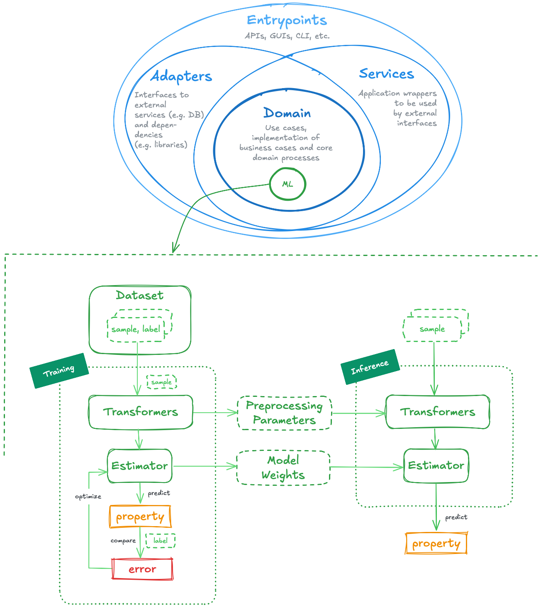
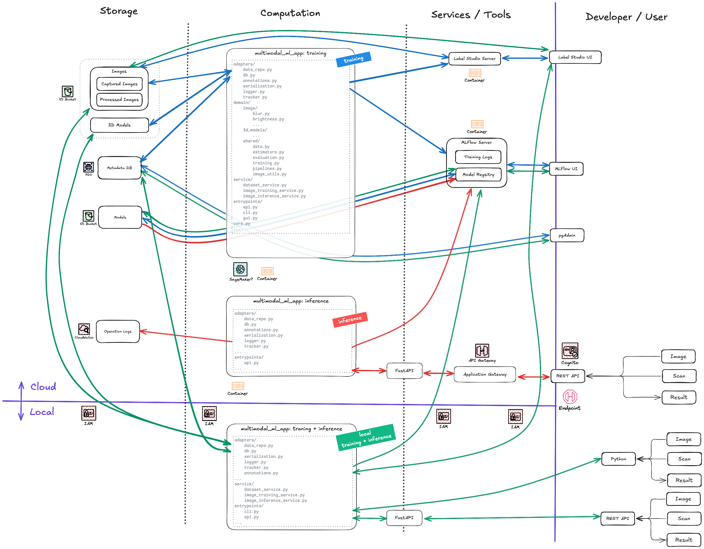

# Multimodal and Multi-Model Machine Learning Service Blueprint

- [Multimodal and Multi-Model Machine Learning Service Blueprint](#multimodal-and-multi-model-machine-learning-service-blueprint)
  - [Introduction](#introduction)
  - [How to Use the Package](#how-to-use-the-package)
    - [Setup](#setup)
    - [Running the Services and the API](#running-the-services-and-the-api)
  - [Package Structure](#package-structure)
    - [Machine Learning Domain Components](#machine-learning-domain-components)
    - [Notes and Conventions](#notes-and-conventions)
    - [How to Extend the Package](#how-to-extend-the-package)
    - [Cloud Architecture](#cloud-architecture)
  - [Testing and Linting](#testing-and-linting)
    - [Nox](#nox)
    - [Pytest](#pytest)
    - [Test Coverage](#test-coverage)
  - [Improvements and TO-DOs](#improvements-and-to-dos)
  - [Interesting Links](#interesting-links)
  - [License and Authorship](#license-and-authorship)

## Introduction

Imagine a construction company that would like to document and validate onsite construction works automatically: skilled workers build different parts of the buildings and they capture images, videos, 3d scans, or even audio clips (e.g., for reverberation assessments) at different stages of the process. We could build an automatic validation service that evaluates the properties of the captured building works; technically, one approach could be to design that service as an API which takes in several data types (or modalities) and predicts their features by using several models.

This repository presents the architecture of a service which addresses situations similar to the introduced and provides with a blueprint implementation:

- The service can handle several modality inputs (image, 3D models, etc.).
- It can run several models in the background which predict/obtain properties of the input data.
- The models can be typical machine-learning-based models (i.e., neural networks, tree-based models, etc.) or rule-based (i.e., metrics are obtained and algebraically expressed rules used to derive properties).
- All model parameters can be trained, persisted, and used later for inference in an API.

The [Domain-Driven Design (DDD)](https://en.wikipedia.org/wiki/Domain-driven_design) architecture patterns are used, adapted to the usual pipelines and lifecycle required by machine learning (ML) projects:

- DDD separates the code in layers: in the core, we have the *domain* or business-case-related code, which is abstracted to build *services*. Additionally, we have interfaces which interact with the domain components, such as *adapters* that connect to external services, or *entrypoints* which expose our services to the users.
- Machine Learning is characterized by two main operation modes: *training* and *inference*. In the first, dataset samples are *preprocessed* or *transformed*, and fed into an *estimator*, which is expected to predict the same output as the ground truth label; if not, the error is used to tune the *parameters or weights* of the underlying *model*. The product of the training process are precisely those *model parameters*. In the second operation mode, those optimized parameters are loaded to the *estimator*; then, a new *transformed* sample fed to it should yield a correct property prediction &mdash; hopefully :wink:. Both operation modes share many components; these components can be generalized for many domain uses cases in which only the data inputs and the transformer and estimator specifications are changed. That's precisely how the ML pipelines are integrated into the DDD architecture in this blueprint. 

In addition, by leveraging principles and techniques from the [Object-Oriented Programming](https://en.wikipedia.org/wiki/Object-oriented_programming) paradigm, we have a clean separation of the different modules, allowing for easier extension and maintainability.



More details on the architecture are provided in [Package Structure](#package-structure). In the next section, the I show how to set up the environment and run the blueprint examples.

:warning: Some final caveats:

- This is a basic template, i.e., don't expect a finished application running on the cloud. Even though some guidelines in that respect are outlined in [Cloud Architecture](#cloud-architecture), the present example ends with a locally running FastAPI service.
- Machine Learning (ML) methods are not in the focus of this blueprint, i.e., no fancy ML models are applied; instead, the key contribution is the architecture and the generalized ML modules than can be reused in many applications. Exemplarily, a simple blur detection method is implemented by extracting Sobel and Laplace features.

## How to Use the Package

In the following, these sections are presented:

- [Setup](#setup) shows how to install the required Python environment and its dependencies.
- [Running the API](#running-the-api) shows how to start using the package by interacting with the FastAPI application.

### Setup

We need to create a dedicated Python environment; here's a quick recipe using [conda](https://docs.conda.io/en/latest/) and [pip-tools](https://github.com/jazzband/pip-tools):

```bash
# On Mac, you'll need to explicitly install libomp
# Additionally, make sure that your Anaconda/Miniforge is for the right architecture (i.e., ARM64 for M1+)
brew install libomp

# Create environment (Python 3.11, pip & pip-tools)
conda env create -f conda.yaml
# Activate environment
conda activate multimodal

# Generate pinned dependencies and install/sync
pip-compile requirements-dev.in --verbose
pip-sync requirements-dev.txt

# Alternatively:
pip install -r requirements-dev.txt

# Install package as editable: changes are immediately reflected without reinstalling 
pip install -e .

# If we need a new dependency,
# add it to requirements.in or requirements-dev.in 
# (WATCH OUT: try to follow alphabetical order)
# And then:
pip-compile requirements-dev.in
pip-sync requirements-dev.txt
```

### Running the Services and the API

First, we need to start the [MLflow](https://mlflow.org/docs/latest/index.html) tracking server:

```bash
# Go to repository folder and activate the environment
cd .../multimodal_ml_service/
conda activate multimodal

# Start the MLflow server
./start_mlflow_tracker.sh
```

Then, in a new Terminal, we can try the *training* and *inference* services as follows:

```bash
# Go to repository folder and activate the environment
cd .../multimodal_ml_service/
conda activate multimodal

# Run Training
python src/service/image_training_service.py

# Run Inference
python src/service/image_inference_service.py
```

Currently, only a simple domain use case is implemented: **blur** detection, i.e., we feed an image and the model predicts whether it's blurry or not.

In addition to using the service modules, we can start the FastAPI server and feed an image to the `/predict_image` endpoint to know about its *blurryness*. To that end, first we start the API from a new Terminal:

```bash
# Go to repository folder and activate the environment
cd .../multimodal_ml_service/
conda activate multimodal

# Start FastAPI server
./start_image_api.sh
```

Then, we can try the API by running the notebook [`try_api.ipynb`](./notebooks/try_api.ipynb), which contains a code similar to the following:

```python
API_URL = "http://localhost:8000"
image_path = "path/to/image.jpg"

base64_image = base64.b64encode(image_file.read()).decode("utf-8")
payload = { "image": base64_image}

response = requests.post(f"{API_URL}/predict_image/", json=payload)
results = response.json()

for pipeline_name, result in response.json():
    print(f"{pipeline_name}: {result}")
```

In some other modules such as [`blur.py`](./src/domain/image/blur.py) or [`tracker.py`](./src/adapters/tracker.py) there are some `run_example()` functions which showcase some additional functionalities. These can be run by executing the corresponding modules, e.g.:

```bash
# Go to repository folder and activate the environment
cd .../multimodal_ml_service/
conda activate multimodal

# Run Training
python src/domain/image/blur.py
```

## Package Structure

The package is structured in the following subfolders, following the DDD paradigm:

- **Adapters**: They provide interfaces to interact with external systems, making the core logic independent of external APIs. Here's where the logger and the tracker are located, as well as the abstractions/connections to databases (unimplemented) or the like.
- **Domain**: Core logic specific to the domain problems; currently only image blur detection is implemented as example. Each subdomain (image, 3D models, etc.) is isolated. There is a common `shared` subdomain which builds all the **Machine Learning** components necessary for ETL, training, evaluation, and inference. These are explained in more detail in [Machine Learning Domain Components](#machine-learning-domain-components).
- **Service**: It handles orchestration and coordination of tasks, such as running the training or inference pipelines of the desired domain cases.
- **Entry-points**: It handles requests from the external environment (Flask API, command line, etc.) which trigger services.
- Config: Centralized management for different environment settings.
- Tests: Structured testing to ensure each component works independently and as part of the integrated system.
- Scripts: Entry scripts to perform manual operations and setup tasks.

```
repository/
    src/                               # Source folder for package
        core.py                        # General definitions/constants (e.g., paths)
        adapters/                      # Interface for interacting with external systems
            data_repo.py               # Repository for managing images (unimplemented)
            db.py                      # Database adapter for general CRUD operations (unimplemented)
            annotations.py             # Label-Studio (unimplemented)
            serialization.py           # De/Serialization utilities
            logger.py                  # Loggers
            tracker.py                 # ModelTracker based on MLflow
        domain/                        # Core business logic
            image/                     # Subdomain for predicting/processing image properties
                blur.py                # Check image blur quality
                brightness.py          # Assess brightness quality of images (unimplemented)
                ...
            3d_models/                 # Subdomain for predicting/processing 3D model properties (unimplemented)
                ...
            shared/                    # Shared logic used across domains
                data.py                # Dataset classes
                estimators.py          # Core model classes for assessments
                training.py            # Trainer and TrainingArguments classes
                pipelines.py           # Training and inference pipeline classes
                evaluation.py          # Metrics and Evaluator class
                image_utils.py         # Resizing, etc.
        service/                           # Application services that handle orchestration
            training_service.py            # Orchestrate model training processes
            evaluation_service.py          # Orchestrate evaluation processes
            quality_assessment_service.py  # Handle different quality assessment pipelines (image, 3D scan, build)
        entrypoints/                       # External access points to the system (Flask, CLI, etc.)
            api.py                         # FastAPI app for serving models + endpoints
            cli.py                         # CLI, Click (unimplemented)
            gui.py                         # Streamlit app (unimplemented)
        config/                                 # Configuration files for managing different environments and parameters
            config.py                           # General configuration parser
            blur_dataset.yaml                   # Config for blur dataset
            blur_estimator_gradients.yaml       # Config for blur estimator based on gradients
            ...
    assets/                                 # Images, etc.
    data/                                   # Local datasets
    scripts/                                # Scripts for various utilities and standalone executions
        start_image_api.sh                  # Start FastAPI application with endpoints
        start_mlflow_tracker.sh             # Start MLflow server for tracking
    notebooks/                              # Jupyter notebooks for experimentation and exploration
        try_api.ipynb                       # Test notebook where packages functionalities are shown, e.g., API interaction
    artifacts/                              # Local binaries & Co. of models and transformers
    logs/                                   # Logging outputs
    tests/                                  # Unit tests using pytest
        data/                               # Test data for different domains
        domain/                             # Tests for core domain logic
            shared/
            ...
```

### Machine Learning Domain Components

A key contribution of the blueprint is the set of machine learning modules contained in `src/domain/shared`.


### Notes and Conventions

- `DataTransformer` can be used either inside an Estimator or before it; it has learnable parameters (via `fit()`), but:
  - Prefer inserting the preprocessing functionality into an `Estimator`/Model if we want to learn the parameters (`LaplacianBlurModel`), e.g., using `SklearnPipeEstimator`.
  - In general, prefer using them outside of the `Estimator` if we don't need to learn the parameters (e.g., `GradientExtractor`) and insert them in the `transformers` list associated to the `Training/InferencePipeline`.
- Even though a `DataTransformer` can be serialized, when used in the preprocessing or ETL phase, try to save/load it as a `YAML` file.
- Tracking (via `ModelTracker`, based on `mlflow`) happens at the `Trainer` level, not at higher levels.

### How to Extend the Package

I see at least three straightforward extension directions:

1. Deploy to the Cloud. See [Cloud Architecture](#cloud-architecture).
2. Add a new model to the `image` subdomain.
3. Add a new subdomain in the same level as `image`, e.g., a new modality, such as 3d models.

### Cloud Architecture

The following figure depicts a possible (not tested) cloud deployment architecture. It is still an open task to further elaborate the draft and implement the basic infrastructure necessary for the deployment.



## Testing and Linting

[Nox](#nox) is leveraged for automated 

- linting (mainly with [ruff](https://github.com/astral-sh/ruff))
- and testing (with [pytest](https://docs.pytest.org/en/stable/)).

### Nox

[Nox](https://nox.thea.codes/en/stable/) makes possible to run different testing and validation tasks usual in CI/CD pipelines.

There is a [`noxfile.py`](./noxfile.py) with a variable `LOCATIONS` in it:

```python
LOCATIONS = "src", "tests", "scripts", "noxfile.py"
```

Here's a brief recipe to use it:

```bash
# Go to package repository
cd .../multimodal_ml_service

# Run all sessions in LOCATIONS
nox

# Run install, ruff and pytest sessions on LOCATIONS
nox -s install ruff pytest

# Run ruff on src/domain
nox -s ruff -- src/domain

# Run ruff and fix code in LOCATIONS
nox -s ruff_fix

# Run pylint on LOCATIONS
nox -s pylint
```

### Pytest

If desired, we can separately run [pytest](https://docs.pytest.org/en/stable/) as follows:

```bash
cd .../multimodal_ml_service
pytest
```

Some notes:

- Pytest configuration: [`pytest.ini`](../pytest.ini)
- Pytest fixtures and general constants/assets used across all tests are defined in [`tests/conftest.py`](../tests/conftest.py)
- A small dataset of images and necessary assets is located in [`tests/data`](../tests/data)
- Temporary (removable) artifacts (models, etc.) output during the tests go to [`tests/artifacts`](../tests/artifacts/)
- All configuration files required for the tests (e.g., dataset metadata, etc.) are located in [`tests/config`](../tests/config/)
- Unit tests from `domain`: [`tests/domain`](../tests/domain)

### Test Coverage

Currently, not all modules of the package have tests. Here's a summary of the coverage:

```
Tested in src.domain.shared
- data:
  - [x] Dataset
  - [x] ImageDataset
  - [-] DataTransformer
  - [x] ImageResizer
  - [x] ImageFormatter
  - [x] (DummyImageTransformer)
- estimators:
  - [-] RuleBasedModel
  - [-] Estimator
  - [x] SklearnPipeEstimator
  - [x] RuleBasedEstimator
  - [x] (DummyRuleBasedModel)
- evaluation:
  - [x] Evaluator
  - [x] get_optimization_direction
- training:
  - [ ] TrainingArguments
  - [ ] Trainer
- pipeline:
  - [ ] TrainingPipeline
  - [ ] InferencePipeline
- image_utils:
  - [x] load_image
  - [x] numpy2pil
  - [x] pil2numpy
  - [x] change_image_channels
  - [x] resize_image
  - [ ] base64_to_image
  - [ ] image_to_base64
  - [ ] resize_images_in_folder
- logger:
  - [ ] Logger
- tracker: 
  - [ ] ModelTracker

Tested in src.domain.image:
- blur
  - [ ] extract_gradients_from_image
  - [ ] extract_laplacian_from_image
  - [ ] LaplacianBlurModel
  - [ ] GradientExtractor
  - [ ] create_blur_estimator
  - [ ] create_blur_training_pipeline
  - [ ] create_blur_inference_pipeline

```

## Improvements and TO-DOs

- [x] Implement `nox` to automate testing and linting.
- [ ] Implement the cloud infrastructure code.
- [ ] Increase test coverage.
- [ ] The `ModelTracker` uses `mlflow.log_artifact()`, not `mlflow.log_model()`, which disables the usage of the MLflow model registry. Change that to use `mlflow.log_model()`.
- [ ] Dependencies: not all are needed?
- [ ] Environment: use `poerty` instead of `pip-tools`?

## Interesting Links

Maybe, you are interested in some related blueprints and guides of mine:

- Design Patterns in Python: [mxagar/design_patterns_notes](https://github.com/mxagar/design_patterns_notes).
- Notes on the Udacity MLOps Nanodegree: [mxagar/mlops_udacity](https://github.com/mxagar/mlops_udacity).

## License and Authorship

Refer to [`LICENSE`](./LICENSE).
